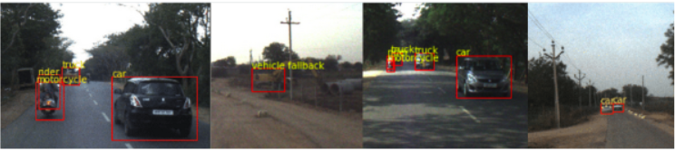

## Domain adaptive Object detection for autonomous navigation 
This repository provides core support for performing object detection on navigation datasets. Support for 3D object detection and domain adaptation are in experimental phase and will be added later. This project provides support for training, evaluation, inference, visualization.

## Prerequisites
- Pytorch >=1.1
- torchvision ==0.3
- tensorboardX (optional, required for visualizing)

## Datasets
This work provides support for the following datasets (related to object detection for autonomous navigation):
- [India Driving Dataset](https://idd.insaan.iiit.ac.in/)
- [Berkeley Deep drive](https://bdd-data.berkeley.edu/)
- [Cityscapes](https://www.cityscapes-dataset.com/) 

Directory structure :
```
+-- data
|   +-- bdd100k
|   +-- IDD_Detection
|   +-- cityscapes
+-- autonmous-object-detection
.......
```
### Getting started
1. Download the required dataset
2. Setup dataset paths in `cfg.py`
3. Create datalists
4. Start training and evaluating

## Documentation

### Setting up Config
By default, all paths and hyperparameters are loaded from `cfg.py`. Users are required to specify paths of dataset and hyperparameters once.
This can also be overriden by user 

### Datalists
We use something called datalists. Datalists are lists which contains path to images and labels. This is because some of the images don't have proper labels. Datalists ensure that the lists only contain structured usable data (dataloader would work seamlessly). Data cleaning happens in the process.

You need to specify a proper path and `ds` variable in the `cfg.py` to specify the dataset you want to use.
```
python3 get_datalists.py
```

### Datasets
It assumes that datalists have been created. This step ensures that you won't get bad samples while dataloader iterates. Create a dir named `data` and put all datasets inside it.
This library uses a common API (similar to torchvision). 
All datasets class expect the same inputs:
```
Input:
    idd_image_path_list
    idd_anno_path_list
    get_transform: A transformation function.
```
```
Output:
    A dict containing boxes, labels, image_id, area, iscrowd inside a torch.tensor.
```
- IDD

```
dset = IDD(idd_image_path_list,idd_anno_path_list,transforms=None)
```

- BDD100K 

```
dset = BDD(bdd_img_path_list,train_anno_json_path,transforms=None)
```

BDD100k doesn't provide individual ground truths. A single JSON file is provided. So creating dataset takes a little longer than usual for parsing JSON.

- Cityscapes

```
dset = Cityscapes(image_path_list,target_path_list, split='train',transforms=None)
```

This was tested for Citypersons (GTs for person class). You can extract GTs from segmentation as well, but user would have to manage datalists.

### Transforms
- ```get_transforms(bool:train)```

converts images into tensors and applies Random Horizontal flipping on input data.

### Model
Any detection model can be used (Yolo,FasterRCNN,SSD). Currently we provide support from torchvision.

```
from train_baseline import get_model
model = get_model(len(classes))    # Returns a Faster RCNN with Resnet 50 as backbone pretrained on COCO.
```

### Training
Support for baseline has been added. Domain adaptive features will be added later.
Users need to specify the path in the script (in user defined settings section) and dataset 

```
$ python train_baseline.py
```

### Evaluation
Evaluation in performed in COCO format. Users need to specify saved `model_name` in `cfg.py`on which evaluation is supposed to occur.

CocoAPI needs to be compiled. first
```
$ cd cocoapi/PythonAPI
$ python setup.py build_ext install
```

Now evaluation can be performed.

```
$ python3 evaluation_baseline.py
```

### Inference

Refer to `inference.ipynb` for plotting images with model's predictions.

### Visualization

By default, tensorboard will start logging `loss` and `learning_rate` in `engine.py`. You can start by using
```
$ tensorboard /path/ --port=8888
```

### Example



### Contribtuion

Feel free to send PRs related to any bugs, support for more datasets etc. 